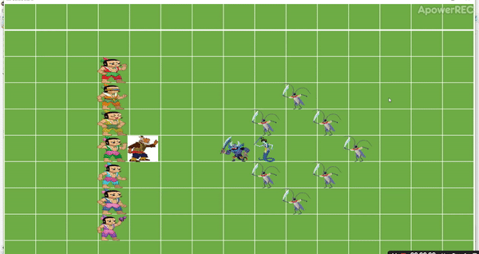

## 葫芦娃小游戏
## 1.游戏介绍
* 运行起来后按空格开始战斗，战斗完成后按F5刷新，按L并选取record.txt文件（战斗完成后会自动生成该文件）回放上一场战斗，在对战中按F5也会进行刷新，会抛出异常，但不影响战斗的继续。本游戏为爷爷率领的葫芦娃长蛇阵VS蝎子精率领的方円阵，战斗开始后，各个生物随机移动，当一个生物要移动到一个有敌人的位置时，双方开战，双方各有50%的概率获胜，败者死亡，留下墓碑，生者踩在败者的墓碑上继续前行，当有一方团灭时，游戏结束。
## 2.总体思路
* 每个生物体实现Runnable接口，写成线程，每个线程在图形界面上表示为一个该生物对应的小图片，通过控制图片在背景中的坐标位置实现图片的移动，通过多线程的协同并发实现多个生物的战斗。
## 3.效果预览
* 
## 4.重要类说明
* Creature类：该类继承了ImageView类并实现了Runnable接口，包括移动、战斗、死亡、设置图片等方法，所有生物该类其派生。
* Battle类：该类主要用于战斗初始化、开始战斗（让各生物线程开始执行）。
* Replay类：该类继承了Thread类，重写了run方法进行战斗回放。
## 5.面向对象的思想方法及各类机制：封装、继承、多态；并发、协同、异常处理。

